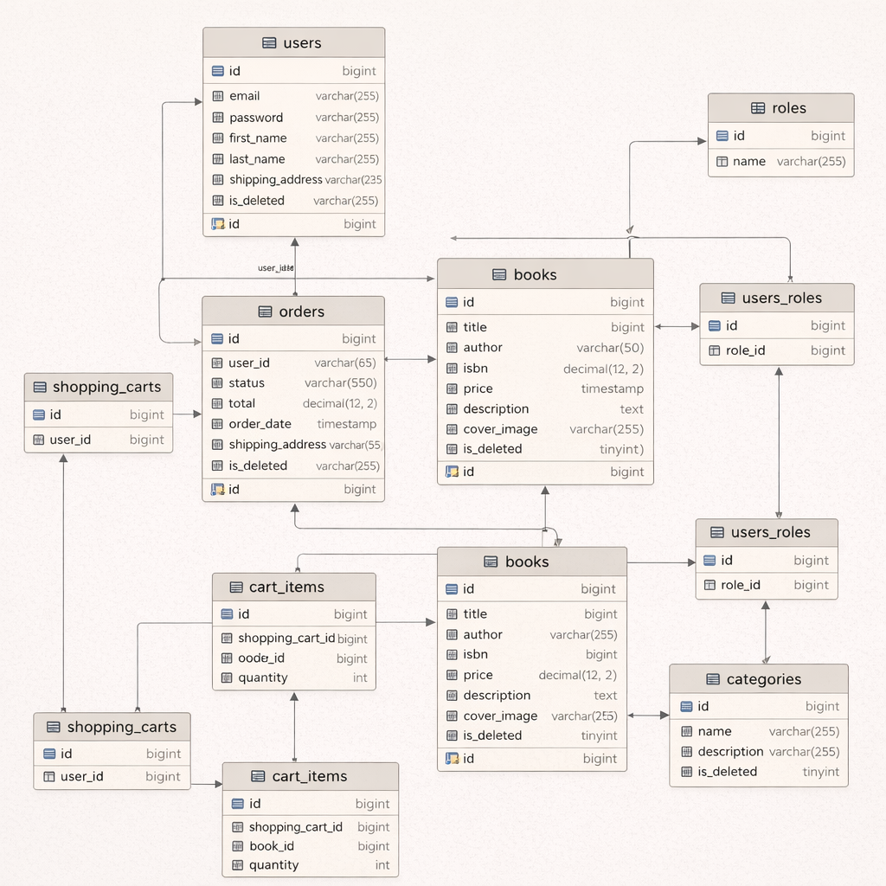
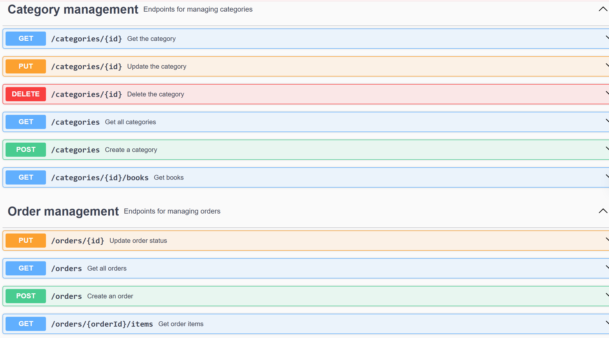

      
   

## Introduction:

Online book sales in the US are projected to reach $10.2 billion in 2025, a 2.9% growth driven by mobile-first shoppers and faster fulfillment. Notably, by 2020, 50% of trade book sales had already moved online. This trend is supported by robust e-commerce growth, with global online retail sales for 2025 expected to exceed $3.6 trillion. The platform lays a solid foundation for a reliable and efficient online book shopping experience.

## Technologies Stack:

- Java (21)
- Spring Framework(Web, Security, Validation, Data-jpa) (v3.3.4)
- MySQL (v8.0.33)
- Liquibase (v4.29.2)
- Lombok (v1.18.34)
- Mapstruct (v1.5.5.Final)
- Maven (v4.0.0)
- JWT (v0.12.6)
- Junit (v1.18.0), Mockito
- Swagger (v2.7.0)
- Docker (v3.2.4, build pshx64) 
- AWS

## Architecture Overview

- This app follows a Layered Architecture pattern:
- DTO Layer: transfers data between different parts of an application, isolating the internal model from external clients.
- Controller Layer: Exposes RESTful endpoints and handles HTTP requests/responses.
- Service Layer: Contains core business logic and mediates between controllers and repositories.
- Mapping Layer: converts data between different representations, transforming domain models into DTOs (and vice versa).
- Repository Layer: Interacts with the database using Spring Data JPA.
- Model Layer: Defines domain entities to be saved in a database.
- Security Layer: Implements JWT-based authentication and role-based access control.

## Endpoints 

The system is built on a RESTful architecture and includes the following main controllers:

#### AuthenticationController

- **POST: /registration** - Register new users (with role USER)
- **POST: /login** - Authenticate existing users with JWT

#### BookController

- **POST: /books** - Create a new book (only for role ADMIN)
- **GET: /books** - View list all available books
- **GET: /books/{id}** - View a book by id
- **PUT: /books/{id}** - Update a book by id (only for role ADMIN)
- **DELETE: /books/{id}** - Mark as deleted a book by id (only for role ADMIN)
- **GET: /books/search** - Filter books by: title, author, price, category

#### OrderController

- **POST: /orders** - Create a new order
- **GET: /orders** - View list all available orders
- **GET: /orders/{id}** - View an order by id
- **GET: /orders/{orderId}/items/{itemId}** - View an item by itemId in the order by orderId
- **PUT: /orders/{id}** - Change status order by id (only for role ADMIN)

#### CategoryController

- **POST: /categories** - Create a new category (only for role ADMIN)
- **GET: /categories** - View list all available categories
- **GET: /categories/{id}** - View a category by id
- **PUT: /categories/{id}** - Update a category by id (only for role ADMIN)
- **DELETE: /categories/{id}** - Mark as deleted a category by id (only for role ADMIN)
- **GET: /categories/{id}/books** - View list of books by category id

#### ShoppingCartController

- **POST: /cart** - Add the item to shopping cart
- **GET: /cart** - View all items in the shopping cart
- **PUT: /cart/items/{id}** - Update the quantity item by id in the shopping cart
- **DELETE: /cart/{id}** - Delete the item by id in shopping cart

## Database Schema Relationship Diagram


## Swagger
Here is the public link to get all commands: [Swagger](http://ec2-13-60-10-180.eu-north-1.compute.amazonaws.com/api/swagger-ui/index.html#)

Swagger should be accessible all the time (similar like on a screenshot):


## How to Clone and Run the Project

Follow these steps to clone the project from GitHub and run it on your local machine:

1️⃣ Clone the Repository Open your terminal or command prompt, and run the following commands:
```bash
git clone https://github.com/SSXcorp/Book-Store-Final.git
cd Book-Store-Final
```
2️⃣ Make sure you have the following installed:
```
Java JDK (version 21.0.7.6 or higher recommended)

Maven (for building and running the project)

MySQL
```
You can check this using cmd commands:
```bash
java --version
mvn --version
mysql --version
```
3️⃣ Configure the Database Check the src/main/resources/application.properties file for database configuration and adjust the database credentials in application.properties.
```
spring.datasource.url=jdbc:mysql://localhost:3306/bookstore
spring.datasource.username=your_mysql_user
spring.datasource.password=your_mysql_password
```
4️⃣ Build and Run the Application Run the following commands in the project directory:
```bash
mvn clean package
mvn spring-boot:run
```
